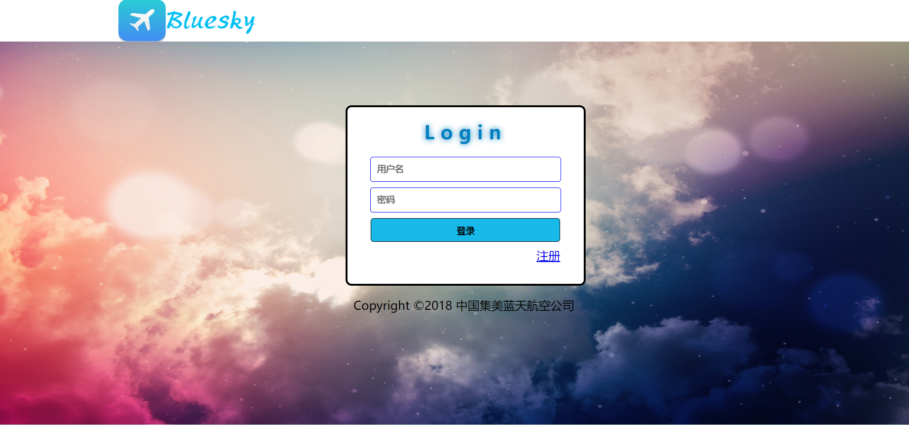

# Uproject 航空订票系统与后台管理 软件工程课设项目
## 有用的话可以给一颗星，多谢。
### clone到本地后，首先确保配置正确
1. 更改config/db.properties下的数据库连接，确保连接本地数据库
2. 创建数据库，数据铺底，sql文件在db目录下
3. 在eclipse或idea中打开项目，配置tomcat
4. 启动tomcat，访问主页http://localhost:8080/proj/index.jsp，登录密码，数据铺地文件有
5. 项目部分页面预览：
 
 
 
